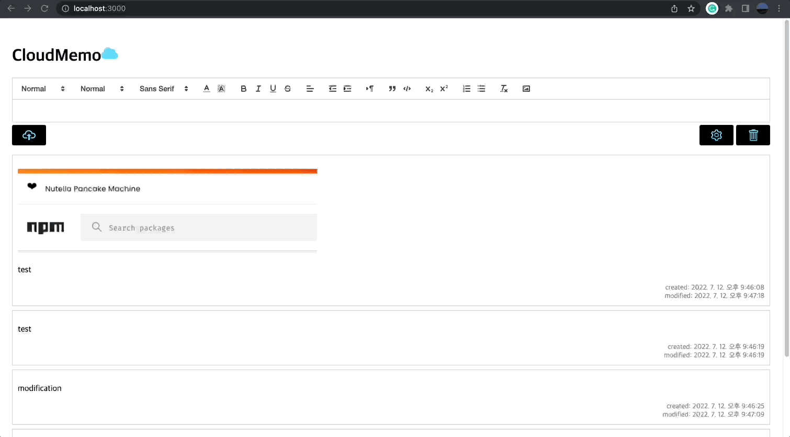
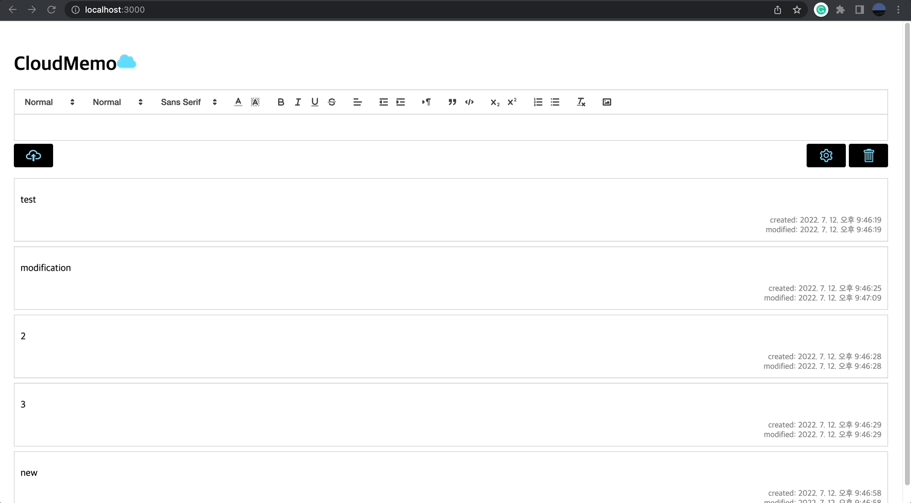

## Cloud Memo

- extended [react-quill web editor](../web-editor/) to cloud memo app

- using node.js [server](./server/)

- client-side routing with `react-router-dom`

  - MainPage

    to create new memo and check all memos in list ui

    provides auto-save

  - MemoDetailPage

    to edit or delete each memo

  - MemoManagerPage

    to delete multiple memos at once

  - MemoTrashPage

    to restore deleted memos or empty the bin

- url of each memo can be copied and shared

  `react-copy-to-clipboard` and `web-share API`

   

  
  
