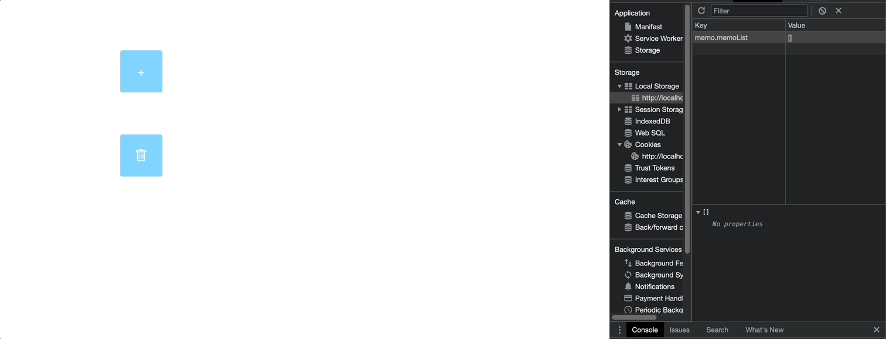

### Simple memopad app using FE local data with

- zustand

  보일러 플레이트가 최소화된 상태관리 solution

  ```typescript
  import create from 'zustand';
  const useStore = create<Interface>(set => ({
    memoList: JSON.parse(localStorage.getItem("memo.memoList") ?? "[]"),
    selectedIndex: undefined,
    addMemoList: (memo: Memo) => {
        set((prev) => {
            const memoList = [ ...prev.memoList, memo ];
            localStorage.setItem("memo.memoList", JSON.stringify(memoList));
            return { ...prev , memoList }
        })
    }, ...
  }))
  export default useStore;
  ```

- localStorage
  
